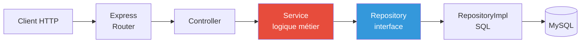

<!-- _class: lead -->
<!-- _paginate: false -->

# 🍳 Recipe Shelter

## Site web collaboratif de recettes de cuisine

**Arthur Lagenebre** — Certification RNCP Développeur Web
[À COMPLÉTER : date de soutenance]
Devant : [À COMPLÉTER : noms des jurés]

<!--
Speaker notes :
- Se présenter en 1 phrase : "Bonjour, je suis Arthur Lagenebre, je présente mon projet de certification : Recipe Shelter, un site collaboratif de recettes de cuisine."
- NE PAS lire le slide. Juste annoncer.
- Respirer. Sourire. C'est le moment où le jury décide s'il a envie d'écouter.
-->

---

# Le pitch en 30 secondes

> **Problème.** Les sites de recettes existants sont saturés de publicité et ne valorisent pas la communauté.

> **Solution.** Une plateforme où les utilisateurs publient, commentent et sauvegardent des recettes — avec une **modération transparente** et une **recherche par ingrédients**.

> **Preuve.** Une application **full-stack** que je vais vous présenter, déployée en ligne, dont **chaque ligne de back-end est écrite à la main**.

<!--
Speaker notes :
- Insister sur "à la main" — c'est le mot qui va capter l'attention. Le jury sait que c'est la contrainte forte du Bloc 2.
- Ne pas lire la slide ! Reformuler à l'oral.
- Durée cible : 40 secondes.
-->

---

# Plan de la présentation

1. **Cahier des charges** et démarche (2 min)
2. **Bloc 1** — Front statique, responsive, accessibilité (2 min)
3. **Bloc 2** — Back-end *from scratch* (8 min) — le cœur du projet
4. **Bloc 3** — Front Angular qui consomme l'API (3 min)
5. **Démo en ligne** (2 min)
6. **Améliorations** et perspectives (1 min)
7. **Vos questions**

<!--
Speaker notes :
- Annoncer franchement que le Bloc 2 prendra le plus de temps — ça calibre les attentes du jury.
- Préciser qu'on garde 15 min pour les questions à la fin.
-->

---

# Cahier des charges — 3 blocs imposés

| Bloc | Exigence clé | Mon choix |
|---|---|---|
| **1. Front statique** | HTML/CSS/JS responsive + accessible WCAG | Angular sert aussi pour le Bloc 1 (✅ vu avec le formateur) |
| **2. Back-end** | **From scratch** — sans framework ni librairie prédéfinie + POO + MySQL | **Node.js + Express 5** + MySQL via `mysql2` |
| **3. Framework** | React / Angular / Symfony / Laravel / Flask | **Angular 21** — SSR, Signals, standalone |

**Contrainte transverse** : tout doit être documenté + déployé en ligne + défendable à l'oral.

<!--
Speaker notes :
- Si le jury sourcille sur "Express", anticiper : "j'y reviens en détail dans 5 minutes — j'ai écrit une ADR dédiée à ce choix."
- Citer le cahier des charges si besoin : "le Bloc 2 demande de coder contrôleurs/modèles/vues sans framework — j'ai interprété ça comme : pas d'ORM, pas de DI container, pas de scaffolding."
-->

---

# Démarche de travail

**Méthodologie incrémentale, traçable, testable.**

- **Git Flow simplifié** : branches `feat/*`, `fix/*`, `docs/*` + Conventional Commits
- **3 repos séparés** : `backend`, `frontend`, `documentation` — découplage assumé
- **Tests dès le début** : ~40 fichiers de tests sur le backend, lancés avec le test runner natif `node:test` (pas de Jest)
- **ADRs** — chaque décision structurante est tracée dans un document court (`Architecture Decision Record`)
- **UML** — 5 diagrammes avant d'écrire la première ligne d'API

<!--
Speaker notes :
- Le jury aime entendre "ADR" — c'est le genre de pratique qu'on voit en équipe sénior. Ça positionne Arthur au-dessus du candidat moyen.
- Si on demande "pourquoi 3 repos ?" : "découplage du cycle de release et clarté de la propriété. C'était un peu lourd à 1 dev, mais ça reflète une organisation pro."
-->

---

<!-- _header: "Bloc 1 — Front statique" -->

# Bloc 1 — Responsive & accessibilité

**Approche** : Angular sert de couche de présentation pour les 2 blocs (1 et 3). Le front respecte les exigences du Bloc 1 *même si* le rendu est piloté par Angular.

- **Responsive** : Bootstrap 5 + media queries personnalisées, testé sur 3 breakpoints (mobile 375px, tablette 768px, desktop 1280px)
- **Accessibilité** : rôles ARIA, contrastes ≥ 4.5:1, navigation clavier complète, `<label>` sur tous les inputs
- **Tests** : BrowserStack sur Chrome / Firefox / Safari / Edge

<!--
Speaker notes :
- Anticiper la question piège : "le Bloc 1 dit HTML/CSS/JS, vous présentez du Angular — c'est conforme ?"
- Réponse préparée : "j'ai validé avec mon formateur avant de partir sur cette approche. Le Bloc 1 vérifie que je sais faire du responsive et de l'accessibilité — peu importe si c'est du HTML pur ou rendu par Angular, l'output final est du HTML que je contrôle."
- Si besoin : "je peux ouvrir l'inspecteur, vous verrez le HTML rendu, les balises sémantiques, les ARIA. Voulez-vous voir ?"
-->

---

<!-- _header: "Bloc 1 — Front statique" -->

# Score Lighthouse

> *[Insérer ici une capture d'écran Lighthouse à 4 jauges]*

| Métrique | Score |
|---|---|
| Performance | [À COMPLÉTER] |
| Accessibility | [À COMPLÉTER — viser ≥ 95] |
| Best practices | [À COMPLÉTER] |
| SEO | [À COMPLÉTER] |

**Outils utilisés** : Lighthouse, axe DevTools, BrowserStack

<!--
Speaker notes :
- Slide à remplir AVANT la soutenance avec la capture réelle.
- Si un score n'est pas excellent : assumer, expliquer pourquoi, dire ce qu'on ferait pour l'améliorer. NE PAS mentir.
- Phrase prête : "j'ai privilégié la justesse sémantique sur la perf — par exemple je n'ai pas lazy-load les images du carrousel, j'aurais pu améliorer la perf de X points."
-->

---

<!-- _header: "Bloc 1 — Front statique" -->

# Conformité WCAG / RGAA

| Critère WCAG | Implémentation |
|---|---|
| **1.4.3** Contraste minimum (AA) | Palette validée à 4.5:1 sur fond clair, 7:1 sur fond foncé |
| **2.1.1** Tout au clavier | `tabindex`, `:focus-visible`, skip links |
| **2.4.4** Liens explicites | Pas de "cliquez ici" — chaque `<a>` a un libellé porteur de sens |
| **3.3.2** Étiquettes de formulaire | Chaque input a un `<label for="">` ou `aria-label` |
| **4.1.2** Nom/rôle/valeur | Rôles ARIA sur composants custom (dialog, menu, alert) |

**Tests** : navigation au clavier seul + lecteur d'écran NVDA sur la home et le formulaire de soumission.

<!--
Speaker notes :
- Si le jury pose une question pointue WCAG (ex: 2.5.5 cible tactile), répondre humblement : "j'ai couvert les critères critiques A et AA en priorité, je n'ai pas tout audité AAA. Je peux vous montrer ce que j'ai validé."
-->

---

<!-- _class: lead -->
<!-- _header: "Bloc 2 — Back-end from scratch" -->

# 🛡️ Bloc 2 — Back-end *from scratch*

## Le cœur du projet — et de cette présentation

<!--
Speaker notes :
- Marquer une pause. Changer de posture. C'est LE moment de la soutenance.
- Annoncer : "je vais passer ~8 minutes sur le Bloc 2. C'est la partie la plus exigeante du cahier des charges et celle où j'ai pris le plus de décisions structurantes."
-->

---

<!-- _header: "Bloc 2 — Back-end from scratch" -->

# « From scratch » — ma définition

Le cahier des charges interdit les **frameworks et librairies prédéfinies**. J'ai tracé la frontière comme ceci :

| ❌ Interdit (pas utilisé) | ✅ Autorisé (utilisé) |
|---|---|
| **ORM** (Sequelize, Prisma, TypeORM) | Driver MySQL (`mysql2`) — bas-niveau |
| **Framework de DI** (NestJS, InversifyJS) | Injection manuelle dans `app.ts` |
| **Scaffolding** (`express-generator`, `nest new`) | Architecture conçue à la main |
| **Validation auto** (Joi, class-validator) | DTOs avec validation maison |
| **Auth packagée** (Passport, Auth0) | JWT + bcrypt assemblés à la main |

> Express et le driver MySQL sont des **interfaces** vers HTTP et la BDD — pas du métier.

📄 Détail : [`soutenance/backend/adr/00-narration-from-scratch.md`](../soutenance/backend/adr/00-narration-from-scratch.md)

<!--
Speaker notes :
- C'est LA slide à savoir parfaitement. Le jury va challenger cette frontière. Préparer la défense :
  - "Express n'écrit pas mon code métier, il transporte les requêtes HTTP. Sans lui, j'aurais réimplémenté `http.createServer` + un parseur de routes — purement plombe-rie, aucune valeur pédagogique ajoutée."
  - "Le test du from-scratch : peut-on remplacer Express par Fastify ou Koa sans toucher au code métier ? Oui — j'ai isolé la couche HTTP. C'est ça, le 'from scratch'."
- Voir l'ADR-001 pour les arguments complets.
-->

---

<!-- _header: "Bloc 2 — Back-end from scratch" -->

# Architecture en couches



- **Controller** : parsing HTTP → DTO → appel service → sérialisation réponse
- **Service** : règles métier (validation, autorisations, orchestration)
- **Repository** : pattern interface + implémentation pour découpler le SQL

**Le service ne sait pas que MySQL existe.** Il parle à une interface. ✅ Testable, ✅ remplaçable.

<!--
Speaker notes :
- Ouvrir `backend/src/app.ts` si le jury veut voir le câblage manuel.
- Phrase pour finir : "cette architecture n'a coûté qu'une journée à mettre en place et m'a fait gagner du temps tous les jours après — chaque test unitaire de service mocke juste le repo, pas la BDD."
-->

---

<!-- _header: "Bloc 2 — Back-end from scratch" -->

# Pattern Repository — exemple concret

**Interface** (`IRecipeRepository`) :

```typescript
interface IRecipeRepository {
  findById(id: number): Promise<Recipe | null>;
  create(data: CreateRecipeDto): Promise<Recipe>;
  softDelete(id: number, by: number): Promise<void>;
}
```

**Implémentation** (`RecipeRepository`) :

```typescript
class RecipeRepository implements IRecipeRepository {
  constructor(private pool: Pool) {}
  async findById(id: number) {
    const [rows] = await this.pool.query('SELECT * FROM recipes WHERE id = ?', [id]);
    return rows[0] ? this.mapper.toDomain(rows[0]) : null;
  }
  // ...
}
```

> Le **service** reçoit `IRecipeRepository`. Il ignore tout du SQL.
> 📄 ADR-002 : pattern Repository interface + impl

<!--
Speaker notes :
- Si le jury demande "pourquoi pas direct dans le service ?" : "parce que je voulais pouvoir mocker en test sans monter une BDD. J'ai 40 tests, ils tournent en < 2 secondes — c'est grâce à ça."
- Si "pourquoi pas un ORM ?" : "l'ORM masque le SQL — or le cahier des charges demande d'optimiser les requêtes. Je préfère écrire le SQL et savoir exactement ce qui part en BDD."
-->

---

<!-- _header: "Bloc 2 — Back-end from scratch" -->

# Schéma BDD — vue domaine

> *[Insérer ici le diagramme `_draft_uml/01-diagramme-classes-domaine.md` (vue social ou complète)]*

**Tables clés** :
- `users` (auth + profil + rôle ENUM `'user'|'admin'`)
- `recipes` (titre, slug, contenu JSON, statut modération)
- `comments`, `favorites`, `categories`, `recipe_categories`

**Choix de modélisation** :
- Soft-delete partout (`deleted_at TIMESTAMP NULL`) — 📄 ADR-004
- Slug en 2 phases (réservation + finalisation) — 📄 ADR-005
- JSON pour ingrédients + étapes — schéma libre, validation côté DTO

<!--
Speaker notes :
- Si on demande "pourquoi JSON et pas une table dédiée 'ingredients' avec relation ?" : "j'ai pesé les deux. Une table normalisée aurait permis la recherche par ingrédient, mais le cahier des charges la demande sur le NOM d'ingrédient, pas un ID. Avec JSON + index full-text, c'est plus simple et la recherche fonctionne. Si on devait gérer les substituts ou les variantes, je passerais à une table normalisée."
-->

---

<!-- _header: "Bloc 2 — Back-end from scratch" -->

# Authentification — JWT + cookie HttpOnly

**Flow d'inscription puis connexion** :

```mermaid
sequenceDiagram
    participant C as Client
    participant A as AuthController
    participant S as AuthService
    participant R as UserRepo
    participant DB as MySQL

    C->>A: POST /auth/login {email, pwd}
    A->>S: login(dto)
    S->>R: findByEmail(email)
    R->>DB: SELECT
    DB-->>R: row
    R-->>S: User
    S->>S: bcrypt.compare(pwd, hash)
    S->>S: jwt.sign({id, role}, secret, 7j)
    S-->>A: token
    A-->>C: Set-Cookie: token=...; HttpOnly; Secure; SameSite=Strict
```

**Pourquoi cookie HttpOnly et pas localStorage ?** Inaccessible au JS → résistant au XSS. 📄 ADR-003.

<!--
Speaker notes :
- Question piège attendue : "pourquoi pas un refresh token ?"
- Réponse honnête : "j'ai limité à un access token 7j pour simplifier. En prod, je rajouterais un refresh token de 30j + rotation à chaque rafraîchissement. Pour la cert, le 7j HttpOnly suffit au scope démandé."
-->

---

<!-- _header: "Bloc 2 — Back-end from scratch" -->

# Sécurité — défense en profondeur

| Menace OWASP | Parade implémentée |
|---|---|
| **A01 Broken Access Control** | Middleware `requireAuth` + `requireRole('admin')` sur les routes sensibles |
| **A02 Cryptographic Failures** | bcrypt 12 rounds pour les mots de passe ; HTTPS en prod |
| **A03 Injection (SQL)** | **Requêtes paramétrées partout** — jamais de concat string |
| **A05 Security Misconfig** | `helmet` désactivé volontairement (from-scratch), headers réécrits à la main |
| **A07 Identification & Auth Failures** | Rate limit sur `/auth/login` (5/min/IP) ; pas d'enum de comptes |

**Validation côté entrée** : tous les payloads passent par un DTO avec validation maison avant d'atteindre le service.

<!--
Speaker notes :
- Si on demande "vous n'avez pas utilisé helmet ?" : "non, j'ai préféré écrire les headers à la main pour être conforme à l'esprit 'from scratch'. Voici les headers que je positionne : X-Content-Type-Options, X-Frame-Options, Referrer-Policy, Strict-Transport-Security en prod."
-->

---

<!-- _header: "Bloc 2 — Back-end from scratch" -->

# Tests — ~40 fichiers, `node:test` natif

```typescript
import { test } from 'node:test';
import assert from 'node:assert';

test('RecipeService.create refuse un titre vide', async () => {
  const repoMock = { create: async () => { throw new Error('should not be called'); } };
  const service = new RecipeService(repoMock as any);
  await assert.rejects(
    () => service.create({ title: '', /* ... */ }),
    /title is required/
  );
});
```

**Couverture** :
- Services métier : validation, autorisation, orchestration
- Middlewares : auth, role, rate-limit
- DTOs : règles de validation
- Mappers : domaine ↔ persistance

**Pourquoi pas Jest ?** Le test runner natif Node existe depuis la 18. Zéro dépendance, zéro config. **Cohérent avec le from-scratch.** 📄 (futur ADR-009)

<!--
Speaker notes :
- Si le jury demande "vous testez les routes Express elles-mêmes ?" : "non, pas en unit. La logique métier est dans les services — je teste les services. Les routes ne font que parser et router. Pour les tester, il faudrait du test d'intégration avec une BDD jetable — c'est sur ma roadmap."
-->

---

<!-- _header: "Bloc 2 — Back-end from scratch" -->

# Modération — soft-delete + log

**Règles métier** :
1. Un commentaire signalé reste **visible** mais marqué `pending_review`.
2. L'admin **n'efface pas** — il **masque** (`deleted_at = NOW()`) et **trace** dans `moderation_log`.
3. L'utilisateur peut être notifié si sa recette est modérée.

```sql
INSERT INTO moderation_log
  (target_type, target_id, action, by_user, reason, at)
VALUES ('recipe', ?, 'hide', ?, ?, NOW());
```

**Pourquoi pas un DELETE pur ?** Traçabilité (RGPD, audit) + réversibilité (erreur de modération). 📄 ADR-004.

<!--
Speaker notes :
- Question RGPD attendue : "et le droit à l'effacement ?"
- Réponse : "le soft-delete est pour la modération. Pour le RGPD, j'ai une route distincte `DELETE /users/me` qui pseudonymise — email remplacé par un hash, contenu anonymisé. Le log de modération garde l'ID interne mais sans PII."
-->

---

<!-- _header: "Bloc 2 — Back-end from scratch" -->

# Cas d'utilisation — vue d'ensemble

> *[Insérer ici le diagramme `_draft_uml/03-diagramme-cas-utilisation.md`]*

**Acteurs** :
- 👤 **Visiteur** : consulter, rechercher
- 🧑‍🍳 **Utilisateur authentifié** : publier, commenter, favoris
- 🛡️ **Admin** : modérer, masquer, restaurer

**Frontières** :
- Inscription = ouverte
- Publication = authentifié
- Modération = rôle admin

<!--
Speaker notes :
- Slide à utiliser comme support pour parler de l'expérience utilisateur de bout en bout. Survoler chaque acteur en 15 secondes.
-->

---

<!-- _class: lead -->
<!-- _header: "Bloc 3 — Angular" -->

# 🅰️ Bloc 3 — Angular 21

## Front-end qui consomme l'API Bloc 2

<!--
Speaker notes :
- Transition franche : "On bascule maintenant côté client. Angular 21 sur la stack la plus moderne possible — Signals + standalone + SSR."
-->

---

<!-- _header: "Bloc 3 — Angular" -->

# Pourquoi Angular 21

| Critère | Décision |
|---|---|
| **Signals** | Réactivité fine, pas de Zone.js — perf garantie sans surveillance manuelle |
| **Standalone components** | Plus de NgModule — chaque composant déclare ses dépendances → lazy load granulaire |
| **SSR (Server-Side Rendering)** | SEO + perf perçue (first contentful paint < 1s) |
| **TypeScript strict** | `strict: true` partout — null-safety, exhaustive checks |
| **Maturité écosystème** | Angular CLI, DevTools, schematics — outillage solide pour 1 dev |

**Le contraste assumé** : Bloc 2 = artisanal, Bloc 3 = industriel. C'est l'esprit du cahier des charges.

<!--
Speaker notes :
- "Pourquoi pas React ?" : "j'ai préféré Angular pour son côté opinionated. À 1 dev, avoir des conventions imposées m'évite de réinventer la structure. React m'aurait demandé de choisir state manager, routing, forms — Angular les fournit cohérents."
-->

---

<!-- _header: "Bloc 3 — Angular" -->

# Architecture front

```
src/app/
├── core/              # services singletons (AuthService, ApiService)
│   ├── guards/        # AuthGuard, AdminGuard
│   └── interceptors/  # AuthInterceptor (cookie auto), ErrorInterceptor
├── shared/            # composants réutilisables (RecipeCard, Modal)
├── features/
│   ├── recipes/       # liste, détail, formulaire
│   ├── auth/          # login, register, profile
│   └── moderation/    # back-office admin (lazy-loaded)
└── app.routes.ts      # routes top-level
```

**State** : `signal()` au niveau service. Pas de NgRx — overkill pour ce projet.

**Communication API** : 1 service par feature, retourne `Observable<T>` (HttpClient) **OU** `Signal<T>` via `toSignal()`.

<!--
Speaker notes :
- Si le jury demande "pourquoi pas NgRx ?" : "même logique que pour l'ORM côté back — c'est une couche d'abstraction qui ne se justifie que pour des apps complexes avec multi-store. Pour 4 features, signals + service suffit."
-->

---

<!-- _header: "Bloc 3 — Angular" -->

# Sécurité côté front

| Préoccupation | Mesure |
|---|---|
| **XSS** | Bindings Angular échappent par défaut ; pas de `innerHTML` non sanitizé |
| **Vol de session** | Cookie HttpOnly → inaccessible au JS → token non volable par script tiers |
| **CSRF** | `SameSite=Strict` sur le cookie + header custom `X-Requested-With` côté Angular |
| **CSP** | Header `Content-Security-Policy` côté serveur, pas d'inline scripts dans Angular build |
| **Erreurs leakées** | `ErrorInterceptor` global qui n'affiche jamais le stack au user, log côté serveur |

**Tests** : Karma + Jasmine sur les composants critiques (formulaire d'inscription, garde admin).

<!--
Speaker notes :
- Important d'enchaîner avec le back : "vous voyez que côté back j'avais déjà choisi le cookie HttpOnly, et côté front Angular hérite naturellement de cette sécurité — l'auth interceptor ne touche jamais au token, il est envoyé automatiquement par le navigateur."
-->

---

<!-- _header: "Bloc 3 — Angular" -->

# Performance & accessibilité

> *[Insérer ici capture Lighthouse Angular ou Angular DevTools]*

- **First Contentful Paint** : [À COMPLÉTER] grâce au SSR
- **Bundle size** : [À COMPLÉTER] — lazy load des routes back-office
- **Hydration partielle** : Angular 21 ne ré-hydrate que ce qui est interactif
- **A11y Angular** : `cdkA11yModule`, focus trap dans les modales, annonces ARIA live

**Le pari** : SSR + Signals donne un site qui *ressemble* à du statique mais qui est dynamique. Bon pour les utilisateurs + bon pour Google.

<!--
Speaker notes :
- Slide à compléter avec les vrais chiffres. Préparer une réponse honnête si le SSR n'est pas en prod : "le SSR est configuré localement, sur la prod j'utilise le rendu client pour réduire la facture serveur — décision pragmatique."
-->

---

<!-- _class: lead -->

# 🎬 Démo en ligne

## [URL de prod à compléter]

<!--
Speaker notes :
- Bascule vers l'écran de démo. Annoncer le scénario AVANT de cliquer (« je vais vous montrer trois choses : 1) la consultation publique, 2) l'inscription + publication d'une recette, 3) la modération côté admin »).
- Avoir DEUX comptes prêts en signets navigateur : `user-demo` et `admin-demo`.
-->

---

# Scénario de démo

1. **Consultation publique** (30 s)
   → Home → recherche par ingrédient → détail d'une recette
2. **Inscription + publication** (45 s)
   → Inscription nouveau compte → formulaire de soumission → publication
3. **Modération** (30 s)
   → Bascule sur le compte admin → file de modération → masquer un commentaire signalé
4. **Responsive en direct** (15 s)
   → Devtools → vue mobile → vérifier que le menu burger marche

**Total démo** : ~2 minutes. Précis, chronométré, répété 3 fois la veille.

📄 Détail : [`soutenance/demo/scenario-demo.md`](../soutenance/demo/scenario-demo.md)

<!--
Speaker notes :
- Si la prod plante : avoir un MP4 de backup de la démo, prêt à lancer.
- Phrase si pépin : "le service en prod a un souci, je bascule sur la vidéo de référence de la démo — c'est exactement le même scénario."
-->

---

# Améliorations envisagées

| Domaine | Amélioration | Effort |
|---|---|---|
| **Auth** | Refresh tokens + rotation | 1 j |
| **Perf** | Cache Redis sur les pages recettes les plus vues | 2 j |
| **Modération** | Pré-filtre auto par modèle ML (toxic-comment) | 5 j |
| **Recherche** | Moteur full-text dédié (Meilisearch / Typesense) | 3 j |
| **Observabilité** | Logs structurés (pino) + Prometheus + Grafana | 2 j |
| **CI/CD** | Tests d'intégration Docker + déploiement auto | 3 j |

> Ces points ne sont pas des manques — ils sont **identifiés**, **chiffrés** et **priorisés**. C'est la différence entre une v1 et un produit.

<!--
Speaker notes :
- Le jury aime entendre "j'ai identifié les manques". Ça montre lucidité + recul + capacité de planification.
- Question attendue : "si vous deviez en prioriser un, lequel ?"
- Réponse : "le refresh token. Pour un site avec compte utilisateur, 7 jours d'access token c'est long. C'est la dette technique qui me dérange le plus."
-->

---

# Ce que ce projet m'a appris

- **Faire des compromis conscients** — chaque ADR est un choix assumé, pas un défaut subi.
- **Le code à la main n'est pas du code primitif** — c'est du code dont on comprend chaque ligne.
- **Tester tôt rend libre** — refactoriser sans peur grâce à 40 tests qui tournent en 2 secondes.
- **Documenter en marchant** — les ADRs ont été écrites au moment de la décision, pas après.
- **Savoir ce qu'on ne sait pas** — j'ai identifié des angles morts (refresh tokens, observabilité, ML) — la prochaine étape c'est de les combler.

<!--
Speaker notes :
- Slide important pour finir sur une note humaine. Le jury n'évalue pas que la technique — il évalue aussi un futur collègue. Montrer maturité.
- Ne pas lire. Choisir 2-3 points sur les 5 et les développer à voix haute.
-->

---

<!-- _class: lead -->

# 🙏 Merci

## Vos questions ?

**Code & docs** :
- Backend → `github.com/[À COMPLÉTER]/recipe-shelter-backend`
- Frontend → `github.com/[À COMPLÉTER]/recipe-shelter-frontend`
- Documentation → `github.com/[À COMPLÉTER]/recipe-shelter-documentation`

**Contact** :
- Arthur Lagenebre — [À COMPLÉTER : email / LinkedIn]

<!--
Speaker notes :
- Sourire. Respirer. Remercier le jury pour leur attention.
- Phrase ouverte : "je suis prêt à répondre à toutes vos questions, et si vous le souhaitez à adapter du code en direct."
- Ne PAS dire "j'espère que ça vous a plu" — c'est se rabaisser. Dire plutôt "j'ai eu plaisir à présenter, je vous écoute."
-->
