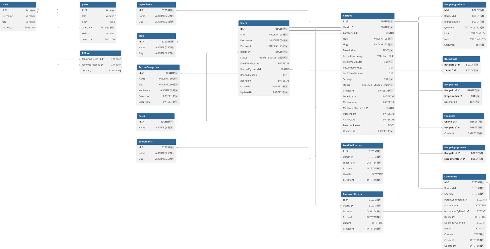

# Schéma de base de données

> Schéma relationnel **MySQL** du backend Recipe Shelter, généré depuis le
> script `database/` du repo backend. Couvre les 15 domaines applicatifs
> (utilisateurs, recettes, commentaires, favoris, modération, etc.).

## Vue d'ensemble

{ loading=lazy }

[:material-image: Version PNG haute résolution](Schema.png){ .md-button }

## Conventions

- **Moteur** : MySQL 8.x (InnoDB par défaut, support des contraintes FK).
- **Nommage tables** : pluriel, snake_case (`users`, `recipes`, `recipe_comments`,
  `recipe_favorites`, …).
- **Clés primaires** : `id` BIGINT auto-increment sur chaque table.
- **Clés étrangères** : `<table_singulier>_id` (ex : `user_id`, `recipe_id`).
- **Timestamps** : `created_at`, `updated_at` (DATETIME) sur les tables
  applicatives ; `deleted_at` pour le **soft-delete** (voir
  [ADR-004](../adr/adr-004-soft-delete-et-log-moderation.md)).
- **Slug** : généré en deux phases (insert → calc → update) — voir
  [ADR-005](../adr/adr-005-slug-en-deux-phases.md).

## Pour aller plus loin

- [Architecture backend](../architecture.md) — couche persistence (section
  « Persistence ») et pattern Repository.
- [ADR-002 — Pattern Repository](../adr/adr-002-pattern-repository-interface-impl.md)
  — séparation interface / implémentation MySQL.
- [Catalogue d'erreurs](../errors.md) — codes d'erreur SQL mappés
  (`ER_DUP_ENTRY` → 409, etc.).
- [OpenAPI](../openapi/index.html) — schémas applicatifs exposés via l'API,
  correspondance avec les tables.

!!! note "Source"

    Le schéma `.sql` complet (DDL avec contraintes, index, triggers) vit dans
    le repo backend, à `database/schema.sql`. Cette page n'expose que la vue
    visuelle ; le DDL fait foi.
