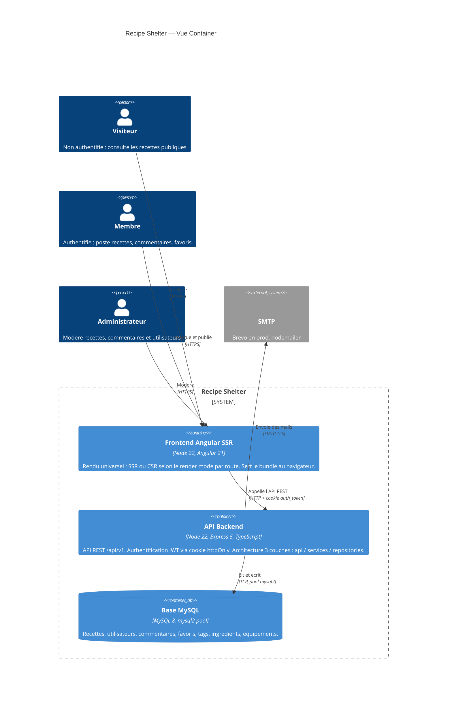

# G1 — Architecture C4 Container

Ce diagramme présente la vue **Container** (C4 niveau 2) de Recipe Shelter. L'objectif est de visualiser les briques exécutables du système et leurs interactions, sans détailler les composants internes.

Le périmètre couvre le frontend Angular avec rendu universel (SSR + browser), l'API backend Express, la base MySQL et le service SMTP utilisé pour les mails transactionnels.

## Notes

- **Pas de container CDN ni de storage objet.** Les images de recettes sont stockees comme **URLs externes** (champ `coverImageUrl` cote DTO, `RecipeCoverImage` en base) — voir `backend/src/repositories/recipes/recipe.types.ts` et `backend/src/api/recipes/recipes.dto.ts`. Aucun upload binaire cote backend (pas de `multer`, pas de S3, pas de dossier `uploads/`). L'utilisateur fournit une URL deja hebergee ailleurs. Si plus tard on ajoute l'upload natif, il faudra introduire un container `Object Storage` (S3, R2, ou disque local) et le tracer ici.
- **Front unique, deux contextes d'execution.** "Frontend Angular SSR" represente un **seul bundle Angular** execute soit cote Node (rendu serveur sur la premiere requete, render mode SSR / prerender par route), soit cote navigateur (hydratation et navigations suivantes en CSR). En C4 Container on les regroupe car ils partagent le code, la build et le deploiement. Une vue Component pourrait separer le moteur SSR Node et le bundle browser si besoin.
- **JWT en cookie httpOnly.** L'API depose un cookie `auth_token` (nom configurable via `env.auth.sessionCookieName`) sur `/api/v1/auth/login`. Toutes les requetes authentifiees (depuis SSR ou browser) le re-transmettent automatiquement. CORS est configure avec `credentials: true` et une whitelist d'origines explicites.
