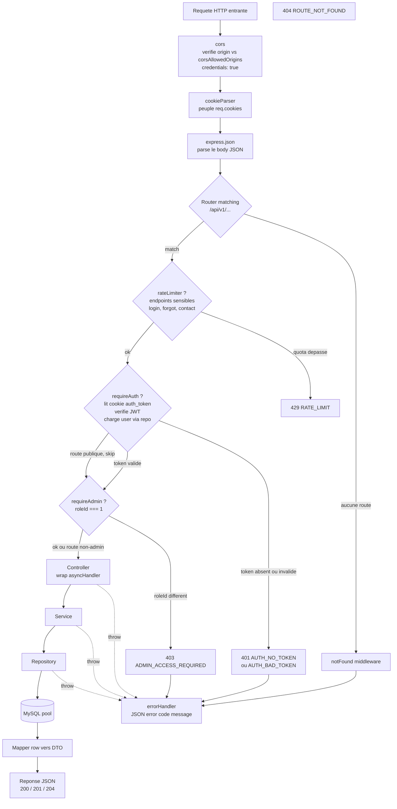

# G2 — Pipeline middleware Express

Ce diagramme detaille le parcours d'une requete HTTP authentifiee a travers la chaine de middlewares Express, telle que cablee dans `backend/src/app.ts` (lignes 70 a 150). Les branches conditionnelles indiquent les points ou la requete peut etre court-circuitee (erreurs 401, 403, 429, 404) avant d'atteindre le controller.

## Legende

- **Losanges** : decisions ou middlewares optionnels (montes par route, pas globalement). Un endpoint public bypasse `requireAuth` ; un endpoint non-admin bypasse `requireAdmin` ; seuls les endpoints sensibles ont un `rateLimiter`.
- **Fleches pointillees** : tout `throw` (ou `next(err)`) dans un controller, service ou repository est capture par `asyncHandler` puis route vers `errorHandler` qui renvoie un JSON normalise `{ error: { message, code } }`.
- **Ordre global fixe** dans `app.ts` : `cors` -> `cookieParser` -> `express.json` -> routers -> `notFound` -> `errorHandler`. L'ordre des middlewares **par route** (`rateLimiter`, `requireAuth`, `requireAdmin`) est defini dans chaque fichier `*.routes.ts`.

## Table des middlewares

| Nom | Fichier | Responsabilite |
| --- | --- | --- |
| `cors` | dependance npm, configure dans `src/app.ts` | Verifie l'`Origin` contre la whitelist `env.http.corsAllowedOrigins`, autorise les credentials (cookie). Refuse si `*` est dans la liste. |
| `cookieParser` | dependance npm, configure dans `src/app.ts` | Parse l'en-tete `Cookie` et expose `req.cookies`. Necessaire pour lire `auth_token`. |
| `express.json` | Express 5 builtin | Parse le body JSON et expose `req.body`. |
| `rateLimiter(max, windowMs)` | `src/middlewares/rate-limiter.ts` | Limite en memoire par cle `ip:method:baseUrl:path`. Renvoie 429 avec en-tetes `RateLimit-*` et `Retry-After`. Utilise sur auth (`auth.routes.ts`) et contact (`contact.router.ts`). |
| `requireAuth` | `src/middlewares/require-auth.ts` | Lit le cookie de session, verifie le JWT (`jwt.verify`), recharge l'utilisateur via `authUserRepository.findById` et verifie qu'il est `active`. Echec -> `unauthorized(...)` -> 401. |
| `optionalAuth` | `src/middlewares/require-auth.ts` | Variante non bloquante : peuple `req.auth` si le token est valide, sinon laisse passer sans erreur. Utile pour les routes publiques qui personnalisent leur reponse pour les membres connectes. |
| `requireAdmin` | `src/middlewares/require-admin.ts` | Verifie `req.auth?.roleId === 1`. Echec -> `forbidden(...)` -> 403. Doit etre monte apres `requireAuth`. |
| `asyncHandler` | `src/api/http/async-handler.ts` | Wrap un handler async pour propager les rejets vers `next(err)`, donc vers `errorHandler`. Sans lui, un `throw` async serait silencieusement avale par Express. |
| `notFound` | `src/middlewares/not-found.ts` | Catch-all monte en dernier avant `errorHandler`. Cree une erreur 404 `ROUTE_NOT_FOUND` et passe la main. |
| `errorHandler` | `src/middlewares/error-handler.ts` | Middleware d'erreur final. Lit `statusCode` (defaut 500), log les 5xx, renvoie `{ error: { message, code } }`. |
