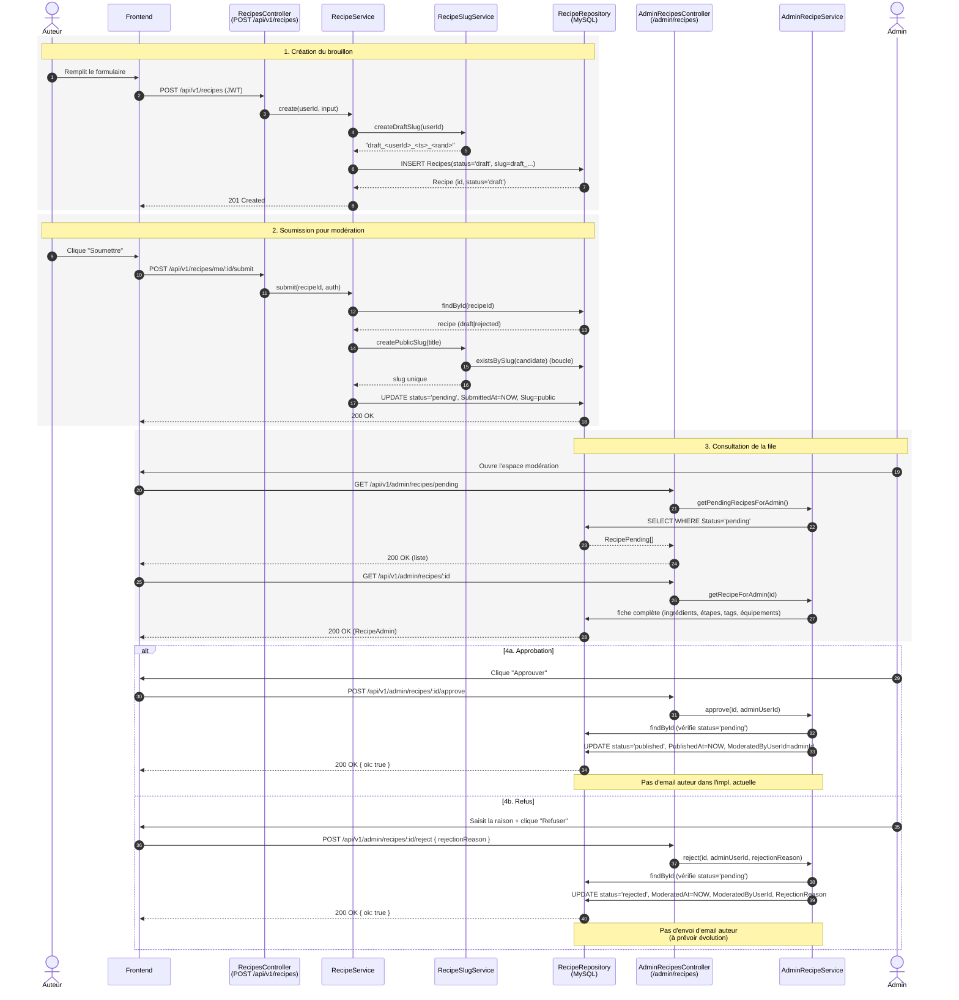

# G3 — Séquence : modération d'une recette

Une recette publiée par un membre de Recipe Shelter suit un cycle de vie contrôlé. L'auteur la crée d'abord en brouillon (`draft`), peut la modifier librement, puis la soumet pour validation (`pending`). Un modérateur consulte la file d'attente, ouvre la fiche complète, et choisit de publier (`published`) ou de refuser (`rejected`) la recette avec une raison. Une recette publiée ou refusée peut ensuite être archivée (`archived`) par l'auteur ou un admin. Le diagramme ci-dessous trace ces transitions de bout en bout.

## Statuts d'une recette

| Statut | Déclencheur | Modifiable par auteur | Visible par public |
|---|---|---|---|
| `draft` | `POST /recipes` (création) | Oui (`PATCH /recipes/me/:id`) | Non |
| `pending` | `POST /recipes/me/:id/submit` | Non | Non (file admin uniquement) |
| `published` | `POST /admin/recipes/:id/approve` | Non (relecture admin) | Oui |
| `rejected` | `POST /admin/recipes/:id/reject` | Oui — peut corriger et resoumettre | Non |
| `archived` | `POST /recipes/me/:id/archive` ou `POST /admin/recipes/:id/archive` | Non | Non |

Note : la table `Recipes` porte aussi les colonnes `SubmittedAt`, `ModeratedAt`, `ModeratedByUserId`, `PublishedAt`, `ArchivedAt`, `RejectionReason` qui tracent l'historique de modération (cf. `admin.recipe.repository.mysql.ts:38`).

## Endpoints utilisés

- `POST /api/v1/recipes` — `recipes.routes.ts:24` → `RecipesController.createRecipe` (`recipes.controller.ts:22`)
- `POST /api/v1/recipes/me/:id/submit` — `recipes.routes.ts:31` → `RecipesController.submitRecipe` (`recipes.controller.ts:99`)
- `GET  /api/v1/admin/recipes/pending` — `admin.recipes.routes.ts:21` → `AdminRecipesController.listPendingRecipes` (`admin.recipes.controller.ts:9`)
- `GET  /api/v1/admin/recipes/:id` — `admin.recipes.routes.ts:23` → `AdminRecipesController.getRecipeAdmin` (`admin.recipes.controller.ts:19`)
- `POST /api/v1/admin/recipes/:id/approve` — `admin.recipes.routes.ts:24` → `AdminRecipesController.approveRecipe` (`admin.recipes.controller.ts:26`)
- `POST /api/v1/admin/recipes/:id/reject` — `admin.recipes.routes.ts:25` → `AdminRecipesController.rejectRecipe` (`admin.recipes.controller.ts:34`)

Les routes admin sont protégées par la chaîne `requireAuth` puis `requireAdmin` (cf. `admin.recipes.routes.ts:21-27`).
