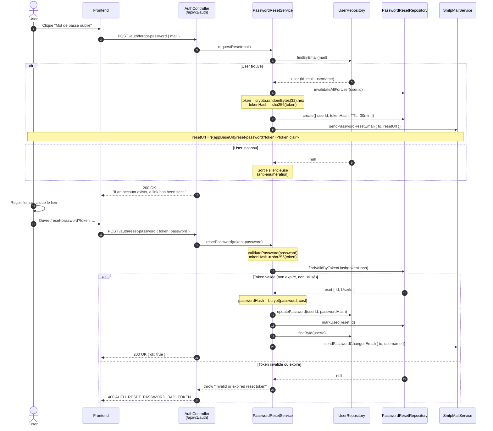
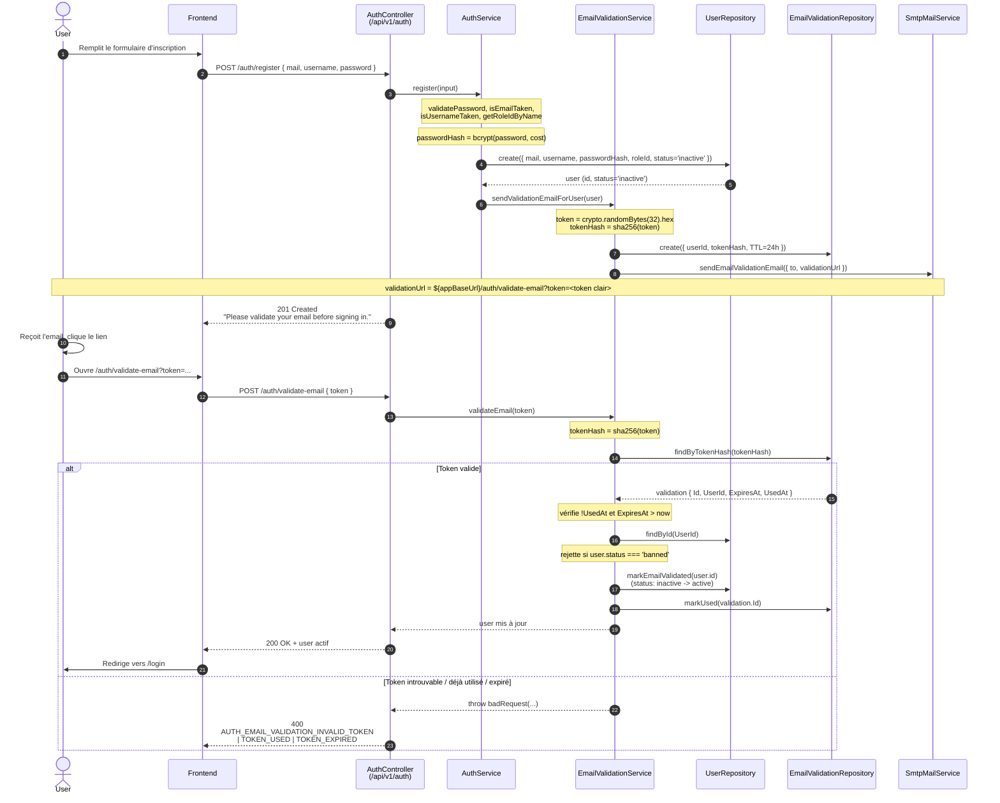

# G4 — Séquences : reset password & validation email

Recipe Shelter s'appuie sur deux flux asynchrones par email pour sécuriser l'accès au compte : la **réinitialisation de mot de passe** (mot de passe oublié) et la **validation d'email** (activation du compte après inscription). Les deux reposent sur le même mécanisme cryptographique : un token aléatoire opaque de 256 bits, stocké uniquement sous forme de hash SHA-256 côté serveur, avec une durée de vie (TTL) limitée.

## A. Reset password

L'utilisateur déclenche la procédure en saisissant son adresse email. Le serveur ne révèle jamais si l'adresse existe (anti-énumération) : la réponse HTTP est identique dans tous les cas. Si l'utilisateur existe bien, un lien signé est envoyé par email ; le clic sur ce lien permet de poser un nouveau mot de passe.

## B. Validation email (signup)

À l'inscription, le compte est créé avec le statut `inactive` : la connexion est refusée tant que l'email n'a pas été validé. Un email contenant un lien signé est envoyé immédiatement ; le clic active le compte.

## Note sécurité

- **Tokens opaques aléatoires (pas de JWT).** Les deux flux utilisent `crypto.randomBytes(32)` (256 bits d'entropie) encodé en hexadécimal, cf. `utils/security/password-reset-token.ts:3`. Le choix d'un token opaque plutôt qu'un JWT est délibéré : un JWT exposerait des claims (userId, type) que l'attaquant pourrait inspecter, et la révocation côté serveur (single-use, invalidation) serait plus lourde. Un token opaque permet une révocation triviale par suppression de la ligne et n'a aucune valeur pour qui n'a pas accès au stockage côté serveur.
- **Hash côté serveur.** Seul `sha256(token)` est persisté (`password-reset-token.ts:7`). Une fuite de la base SQL ne permet pas de rejouer un token : il faudrait inverser SHA-256, ce qui est computationnellement infaisable.
- **TTL court.**
  - Reset password : **30 minutes** (`password-reset.service.ts:22`, constante `PASSWORD_RESET_TTL_MINUTES`)
  - Validation email : **24 heures** (`email-validation.service.ts:15`, constante `EMAIL_VALIDATION_TTL_MINUTES = 24 * 60`)
- **Single-use.** Chaque token est marqué `UsedAt` après consommation (`markUsed`) et ne peut plus être rejoué.
- **Invalidation des tokens existants.** Lors d'une nouvelle demande de reset ou de renvoi du mail de validation, tous les tokens antérieurs du même utilisateur sont invalidés (`invalidateAllForUser`) pour éviter les fenêtres de rejeu concurrentes.
- **Anti-énumération.** `requestReset` (`password-reset.service.ts:34`) renvoie silencieusement si l'email n'existe pas ; le contrôleur répond toujours `200 OK` avec le même message. `resendValidationEmail` (`email-validation.service.ts:32`) suit le même principe pour les comptes inconnus.
- **Rate limiting.** Les routes `/forgot-password`, `/validate-email`, `/resend-validation-email` et `/register` passent par `authRateLimiter` (cf. `auth.routes.ts:22-30`) pour limiter le bruteforce et l'abus du mailer.
- **JWT réservé aux sessions.** Le JWT n'est utilisé qu'après authentification réussie (`auth.service.ts:24`, `signToken`) pour porter la session ; il ne sert jamais à transporter des tokens à usage unique.
