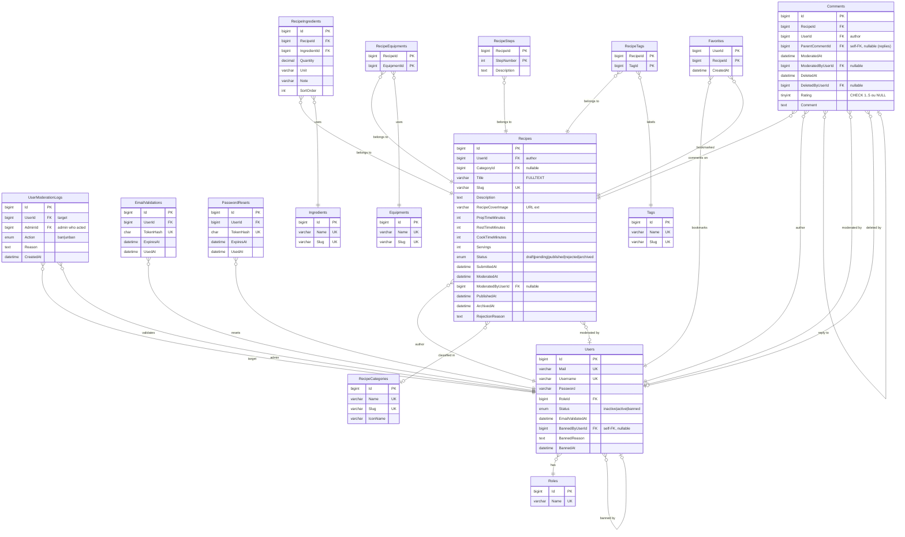

# G5 — ERD (Entity-Relationship Diagram)

Ce diagramme presente la vue **logique** du modele de donnees Recipe Shelter, dans son periphere actuel (17 tables). L'objectif est de donner au jury une lecture rapide des entites, de leurs cles et des relations sans noyer le detail. Pour la liste exhaustive des colonnes, types, contraintes et index, se referer au data-dictionary.

Seules les colonnes structurantes sont representees (PK, FK, colonnes notables : statut, slug, timestamps de cycle de vie). Les colonnes purement techniques ou auditees comme `CreatedAt` / `UpdatedAt` sont omises de la majorite des entites pour rester lisible.

## Legende et points de lecture

- **PK / FK / UK** : cle primaire, cle etrangere, contrainte d'unicite. `PK` marque une colonne qui est a la fois dans la PK composite et FK d'une autre table (cas des tables d'association : `RecipeSteps`, `RecipeEquipments`, `RecipeTags`, `Favorites`).
- **ENUMs MySQL** :
  - `Users.Status` : `inactive | active | banned`
  - `Recipes.Status` : `draft | pending | published | rejected | archived` (cycle de vie editorial)
  - `UserModerationLogs.Action` : `ban | unban`
- **CHECK** : `Comments.Rating` est contraint a `NULL` (commentaire pur, ex: reponse) ou entier `1..5` (note).
- **FULLTEXT** : index `ft_recipes_title` sur `Recipes.Title` pour la recherche texte (`MATCH ... AGAINST ...`).
- **Self-FK** :
  - `Users.BannedByUserId` -> `Users.Id` : tracabilite du ban administrateur (nullable, `ON DELETE SET NULL`).
  - `Comments.ParentCommentId` -> `Comments.Id` : reponses en arbre a un commentaire racine (nullable, `ON DELETE SET NULL`, donc une reply orpheline reste visible).
- **ON DELETE** :
  - `CASCADE` sur la plupart des FK enfantines (suppression d'une recette -> ses steps, ingredients, tags, equipments, favoris et commentaires disparaissent).
  - `RESTRICT` sur les catalogues (impossible de supprimer un ingredient ou tag encore reference).
  - `SET NULL` sur les colonnes d'audit / moderation (on garde la ligne historique meme si l'admin est supprime).

## Note methodologique

Le diagramme est volontairement **denormalise visuellement** : on coupe les colonnes audit / techniques pour garder le schema lisible au tableau pendant la soutenance. Les details exhaustifs (types precis, valeurs par defaut, NULL/NOT NULL, index secondaires, contraintes `ON UPDATE`) sont dans `../data-dictionary.md`. La granularite retenue permet au jury :

1. de voir d'un coup les 17 entites et leurs 4 grands ilots fonctionnels (Identite / Catalogue / Recette / Social) ;
2. d'identifier les cles composites et les self-FK sans avoir a parcourir le DDL ;
3. de relier visuellement les ENUMs aux machines a etats decrites cote architecture.

Ce diagramme reflete strictement la migration `backend/database/migrations/1_create_schema.sql` (source de verite). Tout ecart entre l'application et le schema doit etre traite par migration, pas par drift.

## Cross-references

- `../data-dictionary.md` — liste exhaustive colonne par colonne (types, nullabilite, valeurs par defaut, contraintes)
- `../architecture.md` §9 — modele de donnees et choix de design (cycle de vie recette, moderation, soft-delete commentaires)
- `1_create_schema.sql` — source de verite SQL
