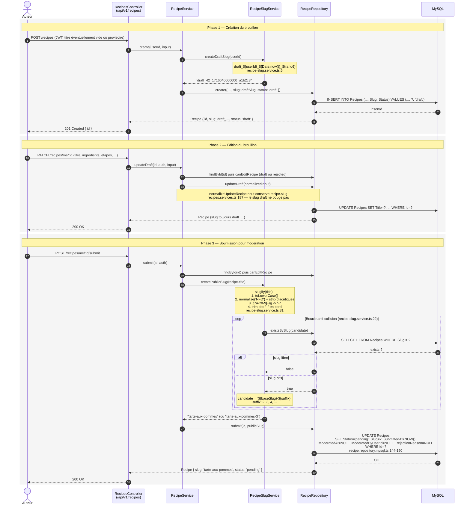

# G7 — Slug en deux phases (recettes)

Une recette de Recipe Shelter n'a jamais d'URL publique tant qu'elle n'est pas validée par un modérateur. Pour autant, il faut bien pouvoir l'identifier dès sa création (édition par étapes, sauvegarde régulière, soumission). Le backend règle ce besoin par un **slug en deux phases** : un slug technique opaque pendant le brouillon, recalculé en slug propre lisible au moment de la soumission. La décision de design est documentée dans [ADR-005](../adr/adr-005-slug-en-deux-phases.md) ; ce diagramme montre **comment** elle est implémentée concrètement, ligne par ligne.

## Pourquoi deux phases plutôt qu'un seul slug

Trois besoins se cumulent et aucun slug unique ne les couvre tous :

1. **L'auteur veut pouvoir créer une recette vide et la remplir en plusieurs sessions.** Sans slug technique dès la création, il faudrait soit forcer un titre dès le premier POST (mauvaise UX, casse le brouillon partiel), soit utiliser l'`Id` numérique comme route (qui devient ensuite l'URL publique — fuite d'information, URLs moches).
2. **L'URL publique doit être propre et stable.** Une recette publiée vit avec son slug pendant des années (référencement, partages, favoris). On veut `tarte-aux-pommes`, pas `recipe-1247` ni `draft_42_1716640000000_a1b2c3`.
3. **Aucun slug `draft_*` ne doit jamais fuiter publiquement.** La forme `draft_{userId}_{ts}_{rand}` n'est utilisée que dans les routes authentifiées `/recipes/me/...`. Les routes publiques (`GET /recipes/by-slug/:slug`) interrogent uniquement les recettes `published` (voir `findPublishedBySlug` dans le repository).

Le choix retenu — slug technique opaque puis recalcul au moment de la soumission — règle les trois sans compromis. Voir [ADR-005](../adr/adr-005-slug-en-deux-phases.md) pour le détail des alternatives écartées.

## Trade-offs et limites assumées

| Sujet | Comportement actuel | Risque | Mitigation présente | Reste à faire |
|---|---|---|---|---|
| Atomicité de la résolution de collision | `existsBySlug` boucle, puis `UPDATE` séparé | Deux soumissions concurrentes avec le même titre peuvent voir `existsBySlug=false` au même instant et l'une des deux échouera sur la contrainte unique | `UNIQUE KEY recipes_slug_UK` sur `Recipes.Slug` (cf. data-dictionary) — la base bloque la collision réelle | L'erreur SQL n'est pas attrapée et retraduite : un utilisateur malchanceux verra une 500 au lieu d'un retry automatique. À corriger (boucle de retry avec `INSERT ... ON DUPLICATE` ou catch sur `ER_DUP_ENTRY`) |
| Slug figé après publication | Modifier le titre d'une recette `published` n'est pas exposé par le service (`canEditRecipe` n'accepte que `draft` ou `rejected`, cf. `recipes.services.ts:124`) | Aucun risque côté URL ; en revanche, impossible pour un auteur de corriger une faute de frappe dans le titre d'une recette publiée sans repasser par un cycle archive/rejet/resoumission | Comportement délibéré : un slug publié est définitif | Si on autorise un jour l'édition post-publication, il faut décider : régénérer le slug (casse les URLs) ou figer le slug et n'éditer que le titre. À trancher avec l'ADR. |
| Slug `draft_*` visible côté auteur | Le `GET /recipes/me/:id` renvoie l'objet complet, slug compris | Faible : seul l'auteur (et un admin) peut voir le brouillon. Le slug technique encode un timestamp et un userId | Routes brouillon protégées par `requireAuth` + vérif owner/admin | Aucune action ; on accepte la fuite côté auteur |
| Génération du suffixe aléatoire | `Math.random().toString(36).slice(2, 8)` — 6 caractères, non cryptographique | Collision théorique sur le slug brouillon entre deux créations du même user dans la même milliseconde | Le triplet `userId + Date.now() + 6 chars` rend la collision pratiquement impossible | Aucune ; passer à `crypto.randomBytes` n'apporterait rien ici (pas un secret) |

## Endpoints utilisés

- `POST /api/v1/recipes` — création du brouillon (`recipes.routes.ts:24` -> `RecipesController.createRecipe`)
- `PATCH /api/v1/recipes/me/:id` — édition du brouillon (`recipes.routes.ts:28`)
- `POST /api/v1/recipes/me/:id/submit` — soumission, déclenche le recalcul du slug (`recipes.routes.ts:31`)

## Cross-réfs

- [ADR-005 — Slug en deux phases](../adr/adr-005-slug-en-deux-phases.md) — la décision et ses alternatives
- [Dictionnaire de données](../data-dictionary.md) — contrainte `UNIQUE KEY recipes_slug_UK` sur `Recipes.Slug`
- [G3 — Séquence de modération](./g3-sequence-moderation.md) — le slug public est figé au moment de l'approbation, pas avant
