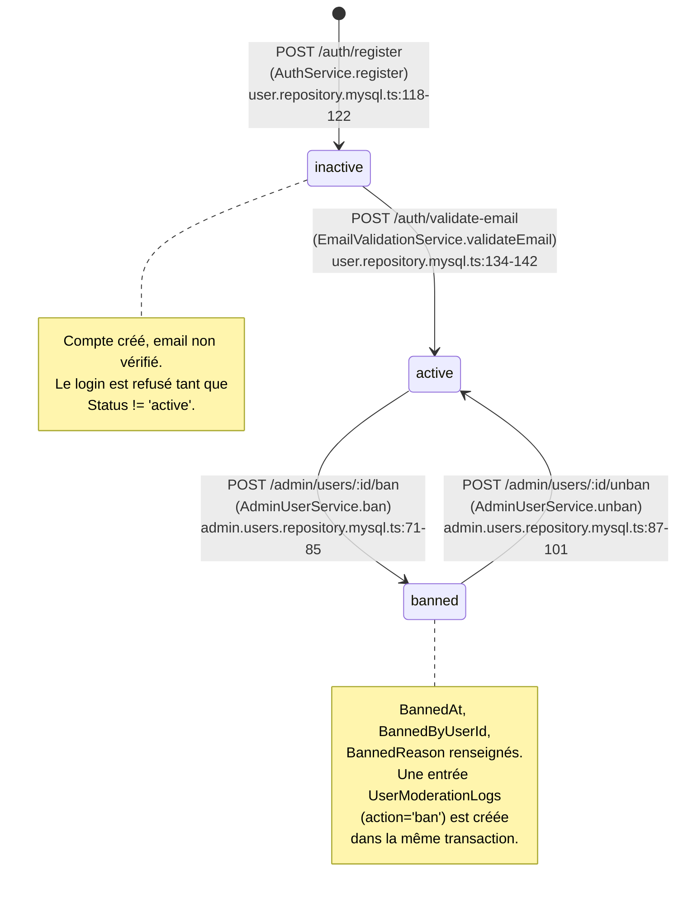

# G8 — Lifecycle d'un compte utilisateur

Le cycle de vie d'un compte Recipe Shelter est porté par la colonne `Users.Status`, un `ENUM('inactive', 'active', 'banned')` (cf. `database/migrations/1_create_schema.sql:21`). Trois états, quatre transitions, et **un état manquant que l'on assume** (voir notes). Comprendre ce diagramme conditionne toute la lecture des vérifications d'authentification et de modération côté admin.



## Transitions

| From | To | Trigger (route) | Effets DB | Side effects | Audit |
|---|---|---|---|---|---|
| `[*]` | `inactive` | `POST /api/v1/auth/register` | `INSERT INTO Users (..., Status='inactive')` (`user.repository.mysql.ts:118`) ; `INSERT INTO EmailValidations` (token hashé, TTL 24h) | Envoi `sendEmailValidationEmail` via SMTP avec lien `${appBaseUrl}/auth/validate-email?token=...` | Pas de log applicatif ; trace via `Users.CreatedAt` |
| `inactive` | `active` | `POST /api/v1/auth/validate-email { token }` | `UPDATE Users SET Status='active', EmailValidatedAt=NOW() WHERE Id=?` (`user.repository.mysql.ts:134-142`) ; `UPDATE EmailValidations SET UsedAt=NOW()` sur le token consommé | Aucun email de confirmation (le frontend redirige vers `/login`) | `Users.EmailValidatedAt` ; le token utilisé reste en base avec `UsedAt` non nul |
| `active` | `banned` | `POST /api/v1/admin/users/:id/ban { reason }` | **Transaction** (`admin.users.repository.mysql.ts:103-129`) : `UPDATE Users SET Status='banned', BannedByUserId=?, BannedReason=?, BannedAt=NOW()` puis `INSERT INTO UserModerationLogs (UserId, AdminId, Action='ban', Reason)` | Aucun email automatique à l'utilisateur banni (à prévoir évolution) | `UserModerationLogs` conserve l'historique complet (qui a banni qui, quand, pourquoi) |
| `banned` | `active` | `POST /api/v1/admin/users/:id/unban { reason }` | **Transaction** : `UPDATE Users SET Status='active', BannedByUserId=NULL, BannedReason=NULL, BannedAt=NULL` puis `INSERT INTO UserModerationLogs (..., Action='unban', Reason)` | Aucun email automatique à l'utilisateur débanni | `UserModerationLogs` conserve l'unban séparément du ban (deux lignes distinctes, jamais d'UPDATE de log) |

## État manquant : `deleted`

Il n'existe **aucun** moyen pour un utilisateur de supprimer son propre compte. Aucune route `DELETE /api/v1/users/me` n'est exposée, et la table `Users` n'a pas de colonne `DeletedAt` ni de statut `deleted`. C'est un trou identifié dans la revue sécurité Vague 1 (voir [securite.md](../securite.md)) et c'est un **point de non-conformité RGPD** : l'article 17 (droit à l'effacement) impose qu'un utilisateur puisse exercer son droit sans passer par une demande manuelle à l'admin.

À prévoir pour la conformité :
- Une route `DELETE /api/v1/users/me` avec confirmation par mot de passe.
- Une stratégie de suppression : soft-delete (`Status='deleted'` + anonymisation Mail/Username) pour préserver l'intégrité référentielle des recettes publiées et des logs de modération, ou hard-delete avec `ON DELETE SET NULL` sur les FK pointant vers `Users` (la table `Recipes` a une FK `UserId` qu'il faudrait revoir).
- Une réflexion sur la conservation des données pour les recettes déjà publiées (anonymisation de l'auteur ? Republication par un admin ? Archivage automatique ?).

À documenter ensuite dans une ADR dédiée et une nouvelle transition `* --> deleted` sur ce diagramme.

## Effets de bord sur le ban : déconnexion immédiate

**Bonne nouvelle vérifiée dans le code :** un ban prend effet **immédiatement**, même pour les sessions JWT déjà émises.

Le JWT en lui-même reste cryptographiquement valide jusqu'à son expiration (la signature ne peut pas être révoquée). En revanche, le middleware `requireAuth` (`middlewares/require-auth.ts:69-92`) ne se contente pas de vérifier la signature du token : il re-vérifie le statut de l'utilisateur en base à **chaque requête** via `resolveActiveAuth` (`require-auth.ts:57-67`) :

```ts
const user = await authUserRepository.findById(auth.userId);

if (!user || user.status !== 'active')
    return null;
```

Conséquence concrète :
- Dès qu'un admin clique "Bannir", la requête suivante de l'utilisateur banni est rejetée en 401 `AUTH_BAD_TOKEN`.
- Aucun JWT révoqué à gérer, aucune blacklist de tokens, aucun TTL court forcé. La source de vérité reste la base.
- Coût : un `SELECT FROM Users WHERE Id=?` par requête authentifiée. C'est le prix à payer pour avoir une révocation immédiate sans complexité de gestion des tokens. À surveiller si la charge augmente (mais l'index PRIMARY rend la requête triviale).

Même logique pour `optionalAuth` (`require-auth.ts:94-117`) : un utilisateur banni accédant à une route publique passe en visiteur anonyme silencieusement.

## Notes annexes

- **Invalidation des tokens de validation email :** la `validateEmail` ne purge **pas** les autres tokens de validation pending du même utilisateur (`email-validation.service.ts:42-77`). Comme un compte ne peut passer de `inactive` à `active` qu'une seule fois et que les tokens ont un TTL de 24h, l'impact est nul en pratique. L'invalidation explicite est faite en revanche lors du `resendValidationEmail` (`email-validation.service.ts:38`), ce qui suffit.
- **Ban d'un utilisateur `inactive` :** la transition `inactive --> banned` n'est pas modélisée ici car le diagramme reflète le flux nominal, mais le code de `ban()` ne filtre pas sur le statut source — un admin peut bannir un compte non validé. Le résultat est cohérent (`Status='banned'`), simplement pas représenté visuellement pour ne pas surcharger.
- **Pas de transition `banned --> inactive` :** un unban renvoie systématiquement vers `active`, jamais vers `inactive`. Si la sémantique souhaitée était "rétrograder à un compte non vérifié", il faudrait l'ajouter explicitement.

## Cross-réfs

- [Revue sécurité — Vague 1](../securite.md) — trou RGPD (suppression compte) et autres points liés
- [Dictionnaire de données](../data-dictionary.md) — tables `Users` (ENUM Status) et `UserModerationLogs` (audit ban/unban)
- [G4 — Séquences auth (validation email)](./g4-sequence-auth-email.md) — détail cryptographique du flux `inactive --> active`
