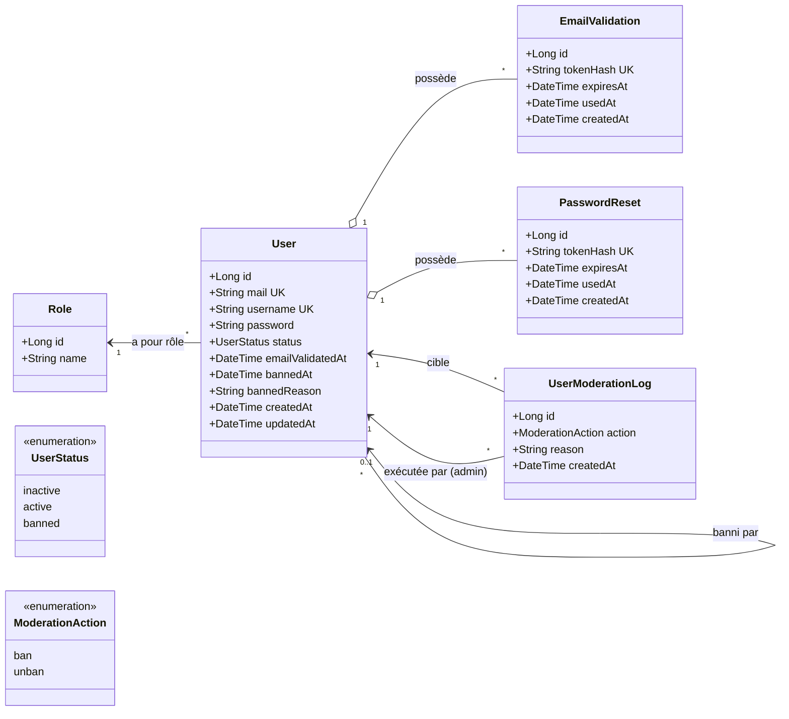
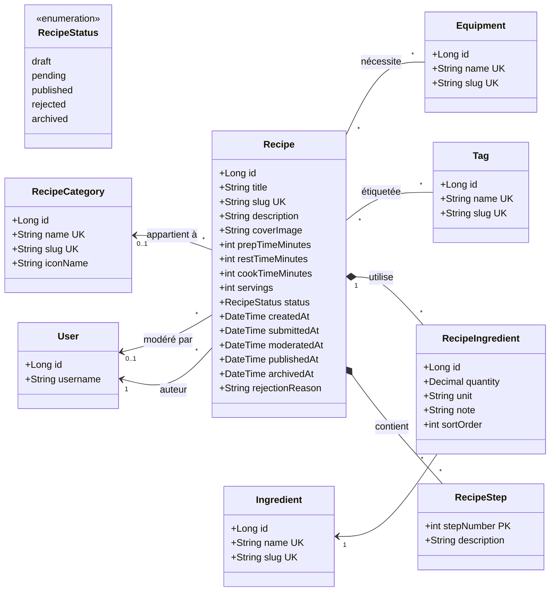
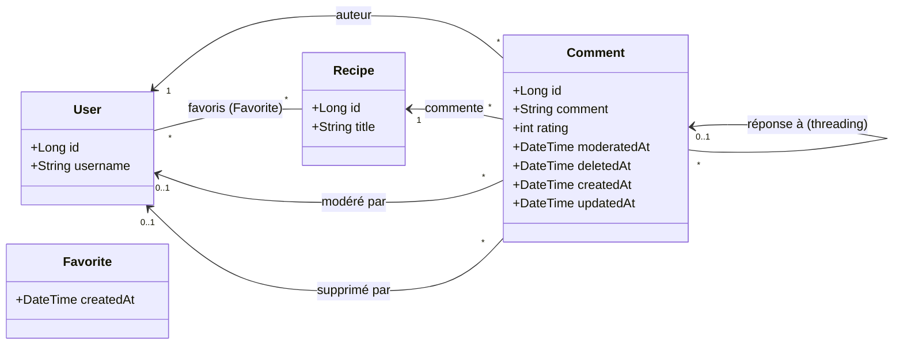

# Diagramme de classes — Modèle de domaine

> Représentation UML du modèle métier de Recipe Shelter, dérivée directement
> du schéma MySQL (`backend/database/migrations/1_create_schema.sql`).
>
> Le modèle est découpé en 3 vues thématiques pour rester lisible.
> Toutes les associations indiquent la multiplicité.

---

## 1. Identité et authentification

**Notes de défense soutenance**
- Le hash du mot de passe est stocké en bcrypt (`BCRYPT_COST` configurable, défaut 12).
- Les tokens de validation/reset sont stockés **hachés** côté serveur, jamais en clair → si la BDD fuite, les tokens ne sont pas exploitables.
- Le statut `banned` est gardé en parallèle d'un log immuable (`UserModerationLogs`) pour conserver l'historique des sanctions.

---

## 2. Recettes et contenus

**Notes de défense soutenance**
- Le cycle de vie d'une recette suit un **état explicite** (`draft → pending → published | rejected → archived`) → traçabilité claire pour la modération.
- `RecipeStep` est une **composition** (clé primaire composite `RecipeId + StepNumber`) : pas d'existence hors de sa recette.
- `RecipeIngredient` est une **classe d'association** : elle porte des attributs propres (`quantity`, `unit`, `note`, `sortOrder`) — c'est plus qu'une simple M2M.
- Le `slug` unique sur `Recipes` permet des URLs lisibles et SEO-friendly côté front (`/recipes/:slug`).

---

## 3. Interactions sociales

**Notes de défense soutenance**
- `Favorite` est une **table d'association pure** (PK = `UserId + RecipeId`) → un utilisateur ne peut pas favoriser deux fois la même recette.
- `Comment` supporte le **threading** via `parentCommentId` (auto-référence), avec validation côté service que le parent est lui-même un commentaire racine (un seul niveau de réponse).
- La **suppression douce** (`deletedAt`/`deletedByUserId`) et la **modération** (`moderatedAt`/`moderatedByUserId`) sont séparées → on garde trace même après action modérateur.
- Note `rating` est `[1..5]` via contrainte SQL `CHECK`.
