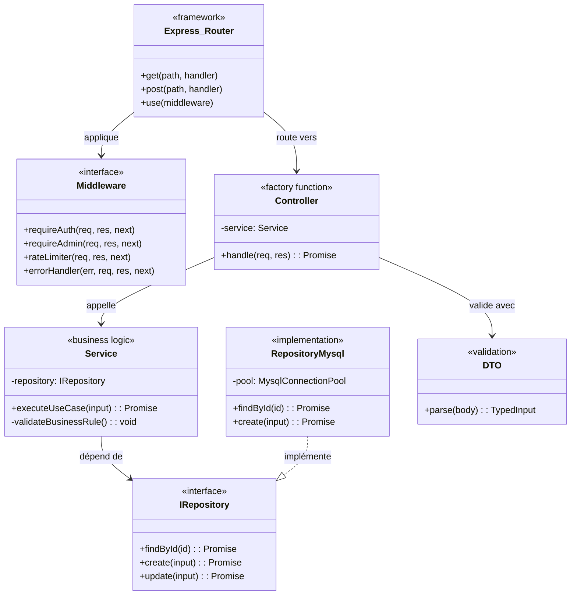
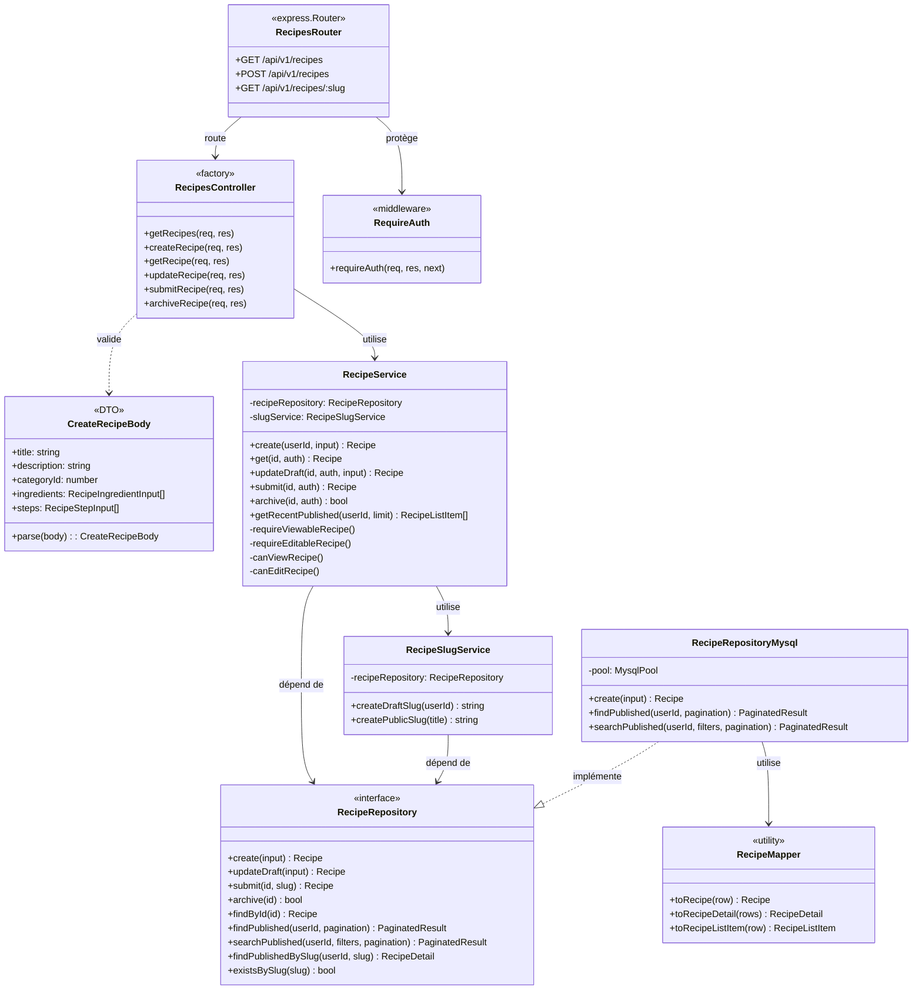

# Diagramme de classes — Architecture backend

> Architecture en couches du backend Node.js/TypeScript, basée sur le pattern
> **Repository** avec inversion de dépendances.
>
> Deux vues : la structure générique du pattern, puis une instance concrète
> sur le domaine **Recipe** (le plus représentatif).

---

## 1. Pattern architectural (vue générique)

**Points-clés à défendre**
- **Inversion de dépendances** : les services ne dépendent que de l'interface du repository, pas de l'implémentation MySQL. Permet de remplacer la BDD ou de mocker en tests.
- **Injection par constructeur** : les services reçoivent leur repository en paramètre du constructeur. Le câblage se fait une fois au démarrage dans `app.ts`.
- **Controllers en factory functions** : `createXxxController(service)` retourne un objet de handlers Express → injection sans framework DI, fidèle au "from scratch".
- **DTO séparés** : la validation des inputs HTTP est isolée des entités métier → couplage faible entre la couche HTTP et la couche service.

---

## 2. Instance concrète — domaine Recipe

**Q/R probable du jury**
- **"Pourquoi cette séparation interface/implémentation ?"** → Permet d'écrire les tests unitaires du service avec un repository en mémoire (cf. `tests/services/recipes/recipes.service.test.ts`), sans démarrer MySQL.
- **"Et si demain vous changez de SGBD ?"** → Il suffit d'écrire `RecipeRepositoryPostgres implements RecipeRepository`, sans toucher au service.
- **"Pourquoi un `RecipeSlugService` séparé ?"** → Single Responsibility : la génération du slug (avec vérification d'unicité en BDD) est une logique métier réutilisable, distincte du CRUD recette.
