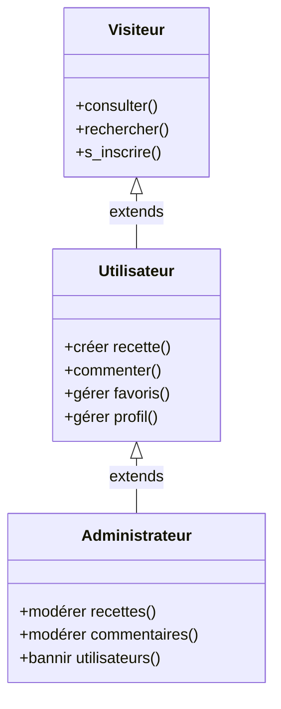

# Diagramme de cas d'utilisation

> Vue UML des acteurs et de leurs interactions avec Recipe Shelter.
> Trois acteurs principaux, organisés par périmètre d'accès croissant.

---

## Diagramme général

```mermaid
graph LR
    Visiteur((Visiteur))
    Utilisateur((Utilisateur authentifié))
    Admin((Administrateur))

    subgraph Public[" Cas d'usage publics "]
        UC1[Consulter les recettes publiées]
        UC2[Rechercher des recettes]
        UC3[Consulter un profil public]
        UC4[Lire les commentaires d une recette]
        UC5[S inscrire]
        UC6[Se connecter]
        UC7[Demander un reset de mot de passe]
        UC8[Envoyer un message via le formulaire de contact]
        UC9[Valider son email]
    end

    subgraph Authentifie[" Cas d'usage utilisateur "]
        UC10[Créer une recette draft]
        UC11[Modifier une de ses recettes]
        UC12[Soumettre une recette à modération]
        UC13[Archiver une de ses recettes]
        UC14[Commenter une recette]
        UC15[Répondre à un commentaire]
        UC16[Modifier ou supprimer son commentaire]
        UC17[Ajouter une recette aux favoris]
        UC18[Retirer une recette des favoris]
        UC19[Consulter ses favoris]
        UC20[Modifier son email]
        UC21[Modifier son nom d utilisateur]
        UC22[Modifier son mot de passe]
        UC23[Se déconnecter]
    end

    subgraph Administration[" Cas d'usage administrateur "]
        UC24[Lister les recettes en attente]
        UC25[Approuver une recette]
        UC26[Rejeter une recette avec motif]
        UC27[Supprimer une recette]
        UC28[Modérer un commentaire]
        UC29[Restaurer un commentaire modéré]
        UC30[Modifier un commentaire]
        UC31[Supprimer définitivement un commentaire]
        UC32[Bannir un utilisateur avec motif]
        UC33[Lever le bannissement d un utilisateur]
        UC34[Consulter le dashboard admin]
    end

    Visiteur --- UC1
    Visiteur --- UC2
    Visiteur --- UC3
    Visiteur --- UC4
    Visiteur --- UC5
    Visiteur --- UC6
    Visiteur --- UC7
    Visiteur --- UC8
    Visiteur --- UC9

    Utilisateur --- UC1
    Utilisateur --- UC2
    Utilisateur --- UC3
    Utilisateur --- UC4
    Utilisateur --- UC8
    Utilisateur --- UC10
    Utilisateur --- UC11
    Utilisateur --- UC12
    Utilisateur --- UC13
    Utilisateur --- UC14
    Utilisateur --- UC15
    Utilisateur --- UC16
    Utilisateur --- UC17
    Utilisateur --- UC18
    Utilisateur --- UC19
    Utilisateur --- UC20
    Utilisateur --- UC21
    Utilisateur --- UC22
    Utilisateur --- UC23

    Admin --- UC24
    Admin --- UC25
    Admin --- UC26
    Admin --- UC27
    Admin --- UC28
    Admin --- UC29
    Admin --- UC30
    Admin --- UC31
    Admin --- UC32
    Admin --- UC33
    Admin --- UC34
```



> Mermaid ne supporte pas nativement les diagrammes UML use case (ovales +
> acteurs stick-figure). On utilise un `graph LR` avec des sous-graphes par
> périmètre — c'est le rendu le plus proche, et il reste lisible.
> Pour une version 100% UML conforme, voir la **note sur PlantUML** en bas.

---

## Hiérarchie des acteurs



L'**héritage des acteurs** (généralisation UML) : un Utilisateur peut tout
faire ce qu'un Visiteur peut faire, et un Administrateur tout ce qu'un
Utilisateur peut faire. Côté code, cette hiérarchie correspond aux
middlewares Express : routes publiques sans middleware, routes
authentifiées avec `requireAuth`, routes admin avec `requireAuth` +
`requireAdmin`.

---

## Notes de défense soutenance

- **Inclusion vs Extension** : ne pas confondre. Si demandé :
  - *Inclusion* `<<include>>` = comportement obligatoire (ex : "Se connecter" inclut "Vérifier les credentials").
  - *Extension* `<<extend>>` = comportement optionnel sous condition (ex : "Soumettre une recette" peut être étendu par "Notifier l'admin").
- Le diagramme ci-dessus reste volontairement **plat** : pas d'`<<include>>` ni d'`<<extend>>` ajoutés pour éviter la sur-modélisation. Le jury préfère un schéma clair à un schéma exhaustif et illisible.
- Si le jury demande "que se passe-t-il quand un user banni essaie d'utiliser le site ?" : le middleware `requireAuth` vérifie `user.status === 'active'` à chaque requête → la session JWT n'est pas suffisante, le statut est revalidé en BDD à chaque requête authentifiée.

---

## Note PlantUML (pour version "UML stricte")

Si le jury exige un vrai diagramme de cas d'utilisation UML (acteurs
stick-figure et ovales), basculer vers PlantUML. La source est conservée
ci-dessous, à exporter via
[plantuml.com/plantuml](https://www.plantuml.com/plantuml/uml/) ou
l'extension VSCode `jebbs.plantuml`.

??? note "Source PlantUML (cliquer pour déplier)"

    ```text
    @startuml
    left to right direction
    actor Visiteur
    actor Utilisateur
    actor Administrateur

    Utilisateur --|> Visiteur
    Administrateur --|> Utilisateur

    rectangle "Recipe Shelter" {
      Visiteur -- (Consulter les recettes)
      Visiteur -- (S'inscrire)
      Utilisateur -- (Créer une recette)
      Utilisateur -- (Commenter)
      Utilisateur -- (Gérer ses favoris)
      Administrateur -- (Modérer)
      Administrateur -- (Bannir un utilisateur)
    }
    @enduml
    ```
