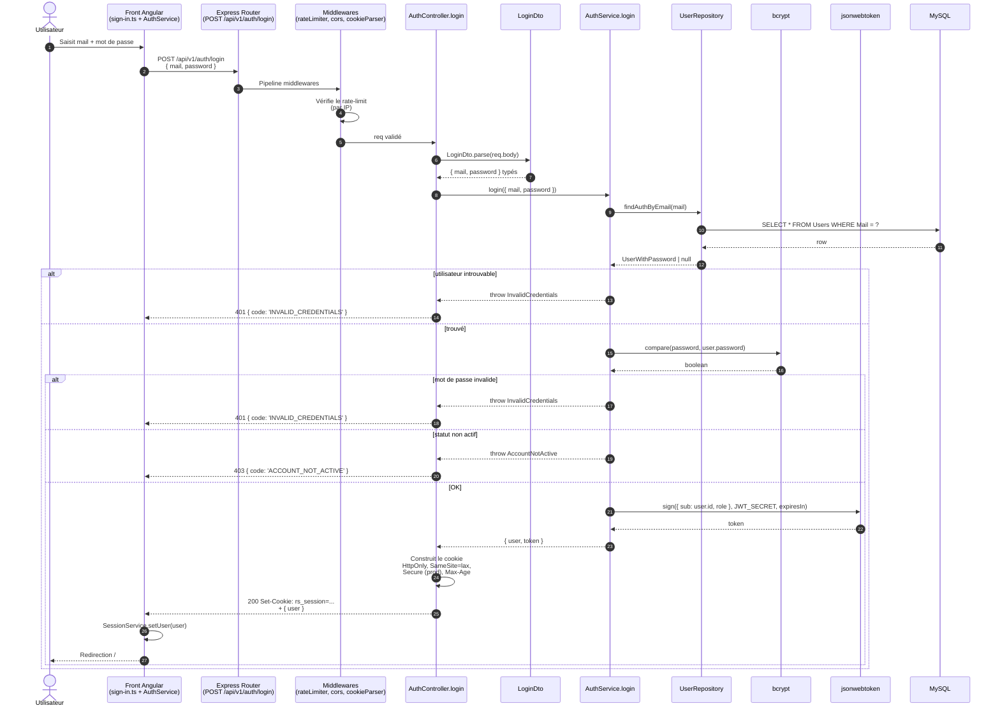
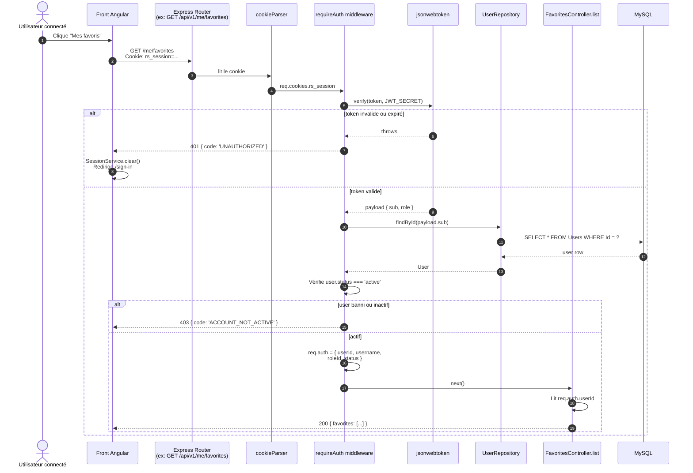

# Diagramme de séquence — Connexion (login)

> Flux complet de la connexion d'un utilisateur, depuis le formulaire Angular
> jusqu'à la pose du cookie de session JWT côté navigateur.
>
> Met en évidence les **points de sécurité** : hash bcrypt, JWT signé,
> cookie HttpOnly + SameSite, vérification du statut utilisateur.

---

## Séquence nominale

---

## Vérification de la session sur une route protégée

---

## Notes de défense soutenance

**Sécurité — points à mettre en avant**

- **Hash bcrypt** avec coût configurable (défaut 12) → résistant aux attaques par force brute hors-ligne.
- **JWT signé HS256** avec un secret de 32 bytes minimum (`crypto.randomBytes(32)`).
- **Cookie HttpOnly** → inaccessible au JavaScript du navigateur → protection contre les vols de token par XSS.
- **SameSite=lax** par défaut → protection CSRF de base sur les requêtes cross-site. Si passage en `SameSite=none`, ajouter un token CSRF (à mentionner si questionné, c'est documenté dans le README).
- **Flag Secure** activé en production → le cookie ne transite qu'en HTTPS.
- **Re-vérification du statut user à chaque requête authentifiée** → un user banni est éjecté immédiatement, sans attendre l'expiration du JWT. Coût : un SELECT par requête authentifiée. Alternative possible : cache court (Redis), mais non implémenté car non nécessaire à l'échelle du projet.
- **Rate-limiting** sur les routes auth (`/login`, `/register`, `/forgot-password`) → limite les attaques par énumération de comptes et par brute-force en ligne.

**Pièges fréquents du jury**

- *"Pourquoi pas de refresh token ?"* → Pour un projet de cette taille, un JWT de 7 jours en cookie HttpOnly est un compromis acceptable. Le pattern access+refresh est plus pertinent quand on a besoin de tokens courts révocables (ex. mobile, multi-device). Mention possible en évolution.
- *"Et si je vole le cookie ?"* → C'est la limite. Mitigations : HttpOnly (pas d'accès JS), Secure (pas en HTTP), durée raisonnable, et révocation côté serveur possible via blacklist (non implémenté ici, à mentionner comme évolution).
- *"Pourquoi pas de bibliothèque type Passport.js ?"* → Cohérent avec l'esprit "from scratch" du Bloc 2 : on utilise les briques de base (`bcrypt`, `jsonwebtoken`) sans framework d'auth opinionated.
