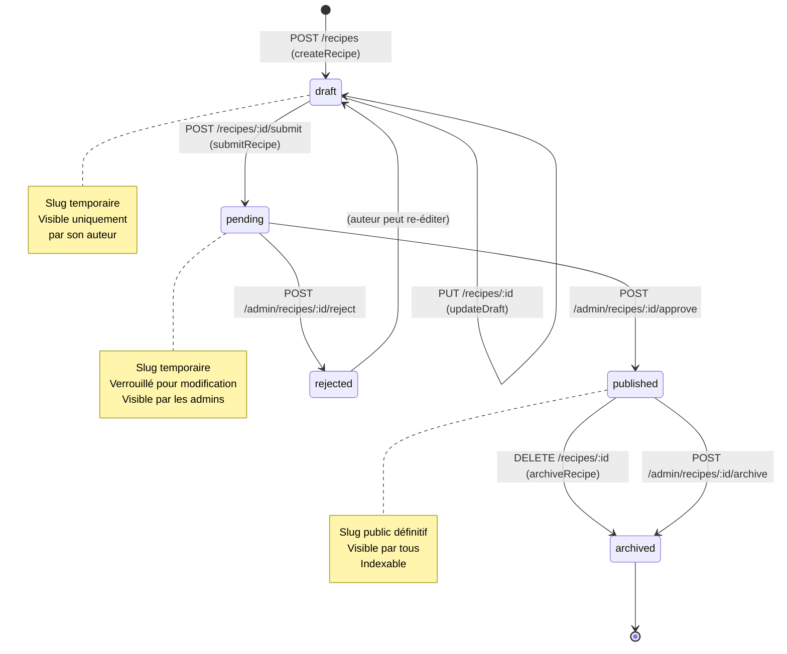
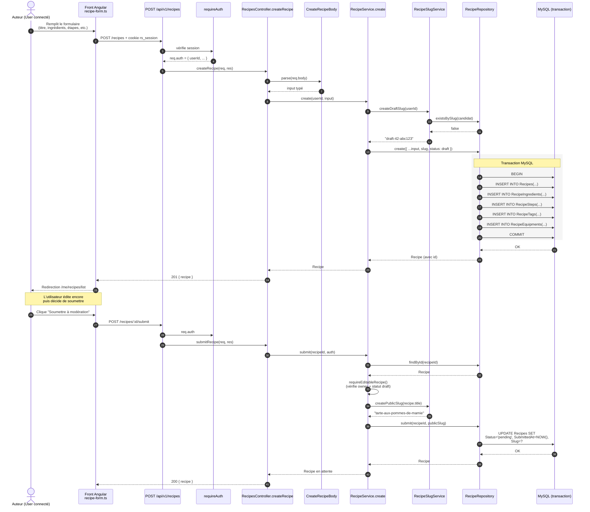
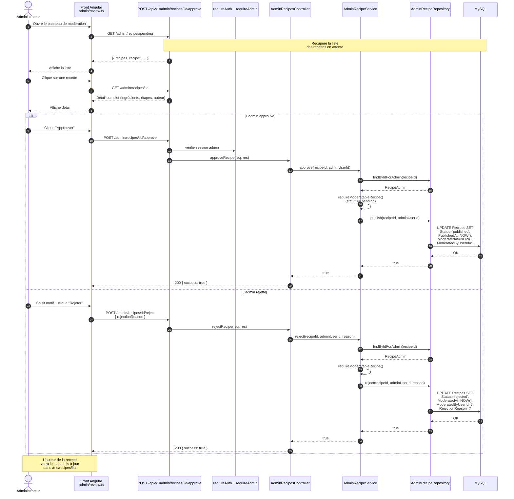

# Diagramme de séquence — Cycle de vie d'une recette

> Couvre le scénario complet : un utilisateur crée une recette brouillon,
> la complète, la soumet à modération, puis un administrateur la publie
> ou la rejette.
>
> Met en évidence la **machine à états** de la recette
> (`draft → pending → published | rejected → archived`).

---

## Vue d'ensemble — machine à états

---

## Création + soumission par l'utilisateur

---

## Modération par l'administrateur

---

## Notes de défense soutenance

**Justifications de design**

- **Statut explicite plutôt qu'un booléen `published`** → permet la traçabilité fine (qui a modéré, quand, pourquoi rejeté). Coût : un type ENUM à maintenir. Bénéfice : audit trail complet et logique de transitions claire.
- **Slug en deux temps** (`draft-X-Y` pendant brouillon, slug définitif au moment de la publication) → évite de "réserver" un slug public pour une recette qui pourrait ne jamais être publiée. Et évite les conflits si plusieurs auteurs préparent des recettes avec le même titre.
- **Transaction MySQL** pour la création → si une INSERT dans `RecipeIngredients` échoue, on rollback tout. Garantit la cohérence : pas de recette orpheline sans ingrédients.
- **Séparation `RecipeService` (auteur) vs `AdminRecipeService` (modération)** → respecte le Single Responsibility Principle, et permet d'avoir des routes Express séparées avec des middlewares différents (`requireAuth` vs `requireAdmin`).
- **`requireEditableRecipe` côté service, pas seulement côté middleware** → l'autorisation métier (owner + statut draft) est plus fine que ce qu'un middleware peut faire. Garde la logique d'autorisation au plus près de la règle métier.

**Q/R probable du jury**

- *"Que se passe-t-il si l'admin clique deux fois sur Approuver ?"* → `requireModeratableRecipe()` vérifie `statut === pending`. Le 2e appel renverra une erreur métier. Pas besoin d'idempotence niveau infrastructure pour ce cas.
- *"Comment gérez-vous les conflits d'édition concurrents ?"* → Le projet n'implémente pas d'optimistic locking (pas de colonne `version`). Pour ce projet pédagogique c'est acceptable, mais c'est une évolution à mentionner si on attend de la concurrence forte.
- *"Pourquoi pas un système de notification email à l'auteur quand la recette est approuvée/rejetée ?"* → C'est une évolution naturelle. Le service `MailService` existe déjà (utilisé pour validation email + reset password) → il suffirait d'ajouter un appel après `publish`/`reject`.
